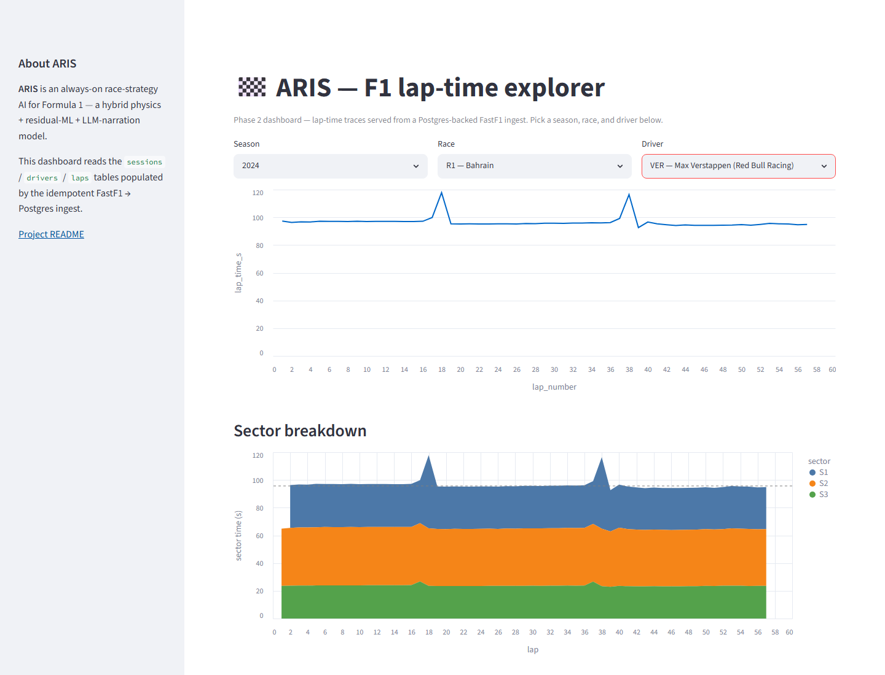
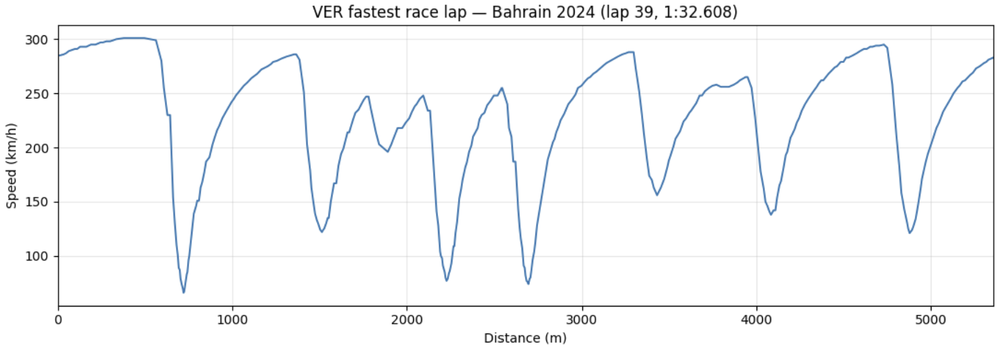

# ARIS

[](https://github.com/AnassNadeem/ARIS/actions/workflows/ci.yml)

> **Disclaimer:** ARIS is an unofficial project. It is not affiliated with,
> associated with, authorized by, endorsed by, or in any way officially
> connected to Formula 1, the FIA, Formula One Group, or any Formula 1
> team or rights holder. “Formula 1”, “F1”, and related marks are
> trademarks of their respective owners.

**An always-on race-strategy software system that watches a live race,
predicts what's about to happen, and proposes the next decision with a
quantified lap-time delta and a calibrated confidence interval — built
on real F1 telemetry, validated end-to-end on held-out races.**

### ▶ Live demo — [**aris-f1.streamlit.app**](https://aris-f1.streamlit.app)

Pick a season, race, and driver and you get that driver's lap-time trace, a
per-sector breakdown, and the **MA(2) baseline floor a model has to beat** —
served live from an idempotent FastF1 → Postgres ingest of the 2024 season,
cross-checked against the pandas baseline at machine epsilon. No build to run,
no notebook to open: the pipeline is the page.

[](https://aris-f1.streamlit.app)

**Where it stands today:** Phase 2 (`v0.2-pipeline`) is tagged and live — FastF1 →
Postgres ingest with an idempotent, all-or-nothing-per-session pipeline, a
moving-average lap-time baseline per tyre stint, and a public Streamlit lap
explorer. The baseline is computed twice — once in pandas, once as a
Postgres window query — and the two match to **machine epsilon** across eight
reference races (canary that the ingest is lossless). That baseline —
**0.460 s MAE on green-flag laps** — is the floor any predictor has to beat.

Beyond the tag, `main` also carries a **v1 strategy demo** (physics + tyre
slopes + XGBoost residual, pit counterfactuals, MC bands, Strategy page with
field/decision queue). After Phase C (tune + inverse-variance blend with MA(2)),
held-out MAE on five 2024 races is **MA(2) 0.469 · physics-only 15.211 ·
physics+residual 0.787 · blended 0.549 s**. The blend is the closest stack to
baseline but still does **not** beat it. Tags past `v0.2-pipeline` have not been cut.

---

## Status

| | |
|---|---|
| **Started** | 2026-05-04 |
| **Ship target** | 2026-08-31 (`v1.0-shipped`) |
| **Current phase** | Phase C (close predictor gap + richer actions) complete on `main`; strategy demo present but untagged past `v0.2` |
| **Live demo** | [aris-f1.streamlit.app](https://aris-f1.streamlit.app) |
| **Last tag** | [`v0.2-pipeline`](https://github.com/AnassNadeem/ARIS/releases/tag/v0.2-pipeline) — Postgres ingest + live lap explorer; baseline floor **0.460 s MAE** on green-flag laps across 8 races / 6383 laps |
| **Held-out predictor MAE** | **MA(2) 0.469 · physics-only 15.211 · physics+residual 0.787 · blended 0.549 s** on 5×2024 races (`results/heldout-laptime-mae.csv`) — blended is closest but still does **not** beat baseline |
| **Cadence** | 6 hrs/day × 6 days/week (Sundays off) |

This repo is **under active construction**. Phases ship sequentially as
tagged releases; nothing in this README is an over-claim of state. See
[`BUILD-LOG.md`](./BUILD-LOG.md) for the daily log — friction included.

---

## What ARIS is

A **hybrid AI race strategist**. Six components, layered:

| Layer | Component | Approach |
|---|---|---|
| L0 | Telemetry ingest | FastF1 historical + live timing |
| L1 | State estimation | Per-tick `RaceState` snapshot |
| L2 | Lap-time predictor | Hand-coded bicycle model + tire deg curve, with an XGBoost residual learned on FastF1 data |
| L3 | Counterfactual simulator | Perturb action → predict outcome (`simulate(state, action) → delta`) |
| L4 | Recommender | Action search + Monte Carlo over remaining race, MC percentile bands (not calibrated conformal) |
| L5 | Narrator | Local Llama 3.1 turns top recommendation into one-sentence radio call |
| L6 | Dashboard | Streamlit (`apps/`): lap explorer + Strategy (Watch · Ask · What-if · Replay) |

It runs **always-on** against a race replay (FastF1 historical, treated
as live), updating recommendations on a tiered cadence:
1–2 s monitor · sector-level micro · lap-level macro · event-driven recompute.

## What ARIS is NOT

| | |
|---|---|
| ❌ **A world model** | No learned latent dynamics. The simulator is hand-coded physics + ML residual. Not Dreamer, RSSM, or GAIA-1. |
| ❌ **Reinforcement learning** | No learned policy, no reward signal. Action selection is search-based, not policy-gradient. |
| ❌ **An LLM agent** | The LLM narrates. It does not control. |
| ❌ **Deep learning at its core** | The deep component is the LLM, used pretrained for narration only. |

The discipline matters: F1 hiring managers can spot over-claims in 30s.
ARIS is *classical decision support* stitched together with *modern ML
and LLMs* — and that's what gets it through interview scrutiny.

---

## Stack

**Core:**
Python 3.11 · NumPy · pandas · scikit-learn · XGBoost · FastF1

**Data + dashboard (Phase 2):**
Postgres 16 · SQLAlchemy 2.0 · Streamlit · Docker

**Inference + narration (Phase 6):**
Ollama · Llama 3.1 8B (q5_K_M, local on RTX 5070)

**Validation (parallel, Phase 5–6):**
MATLAB / Simulink port of the bicycle module — separate repo
[`aris-matlab-validation`](#) (link when published)

---

## Roadmap

Status key: ✅ tagged · ◐ code on `main`, tag not cut · ○ not done.
“◀ next” marks the next **tag** to cut after Phase A review — not “nothing exists yet.”

| Phase | Weeks | Output | Tag | Status |
|---|---|---|---|---|
| 0 | 0 | Loadout — Python, Docker, Ollama, NVIDIA + CUDA, repo skeleton | (prep, untagged) | ✅ |
| 1 | 1–2 | Python foundations + first FastF1 plot | `v0.1-foundation` | ✅ |
| 2 | 3–4 | Postgres ingest + Streamlit lap explorer, deployed | `v0.2-pipeline` | ✅ |
| 3 | 5–7 | Lap-time predictor (physics + residual ML); honest held-out MAE published | `v0.3-predictor` | ◐ code yes; Phase C blended **0.549 s** (above MA(2) 0.469 s); tag not cut |
| 4 | 8–9 | Counterfactual simulator (pit + lift/brake actions) | `v0.4-counterfactual` | ◐ pit + lift/brake on `main`; tag not cut |
| 5 | 10–11 | Always-on Strategy loop + MC bands; MATLAB port begins | `v0.5-always-on` | ◐ engine + Strategy UI + MC; MATLAB not started; tag not cut |
| 6 | 12–13 | LLM narration + grounded Ask; MATLAB validation finish | `v0.6-narrated` | ◐ narration + keyword Ask; true RAG / MATLAB open; tag not cut |
| 7 | 14–15 | Eval harness, real conformal (mapie), backtest report, demo video | `v1.0-shipped` | ○ (Phase A only stabilized naming/leakage) |
| 8 | 16–17 | Placement-applications-ready CV + cover letters | `v1.0-placement-ready` | ○ |

---

## Repo layout

```
ARIS/
├── src/aris/           # production logic (io, eval, physics, models, strategy)
│   ├── io/             # Postgres + FastF1 ingest
│   ├── eval/           # baselines, scoring, laptime harness
│   ├── physics/        # bicycle model, tyres, stint detection
│   ├── models/         # features, residual XGBoost, predict
│   ├── state.py        # RaceState snapshot
│   ├── simulate.py     # counterfactual pit/stay-out
│   ├── montecarlo.py   # slim MC confidence layer
│   ├── recommend.py    # top-3 strategy search
│   └── narrate.py      # Ollama radio-call narration
├── apps/               # Streamlit (lap explorer + Strategy page) — canonical UI
├── scripts/            # ingest, train_residual, smoke_strategy, deploy_to_neon
├── models/             # gitignored trained artefacts (residual_xgb.json)
├── tests/
├── BUILD-LOG.md
└── ARIS-EXECUTION-PLAN.md
```

---

## Getting started

The fastest way to see ARIS is the [live dashboard](https://aris-f1.streamlit.app) —
nothing to install. To run it yourself, clone and set up the environment (uv is the
recommended path; a plain-pip fallback is in `requirements.txt`):

```powershell
git clone https://github.com/AnassNadeem/ARIS.git
cd ARIS

# uv (recommended — mirrors CI exactly)
uv sync --extra dev

# ...or plain pip
python -m venv .venv; .\.venv\Scripts\Activate.ps1
pip install -r requirements.txt

# Run the test suite (DB integration tests skip without ARIS_DB_URL)
uv run pytest
```

**Run the dashboard locally (Phase 2).** Bring up Postgres, ingest a season, then
launch Streamlit. The app reads `ARIS_DB_URL` from a repo-root `.env` (see
[`.env.example`](./.env.example)); the full cloud runbook is in [`DEPLOY.md`](./DEPLOY.md).

```powershell
docker compose up -d                       # local Postgres on :5432
python scripts\ingest_season.py 2024       # idempotent — re-running never duplicates
streamlit run apps\streamlit_app.py        # → http://localhost:8501
```

**Replay the baseline cross-check** — the canary that proves the ingest is lossless:

```powershell
python scripts\baseline_crosscheck.py      # SQL vs pandas MA(2), must match to ~1e-15 s
python -m aris.eval.run_baseline_all_races # regenerate the 0.460 s green-flag floor
```

The FastF1 cache lands in `fastf1_cache/` (gitignored — regenerable); subsequent
`session.load()` calls return in ~1 second.

---

## v1 strategy demo (end-to-end)

ARIS v1 adds a **Race Strategy** page: pick a replay lap, optionally override
compound/fuel, and get top-3 pit/stay-out recommendations with a narrated radio call.

**Prerequisites:** Postgres with 2024 season ingested, FastF1 cache warmed, and
(optionally) the trained residual model in `models/residual_xgb.json`.

```powershell
# 1. Environment
docker compose up -d
uv sync --extra dev          # or: pip install -r requirements.txt
python scripts\ingest_season.py 2024

# 2. Train the XGBoost residual (first run only; ~2 min with warm cache)
python scripts\train_residual.py

# 3. Launch dashboard — use the "Strategy" page in the sidebar
streamlit run apps\streamlit_app.py

# 4. CLI smoke test (Bahrain 2024 R, VER, lap 15)
python scripts\smoke_strategy.py --no-llm

# 5. Held-out lap-time MAE eval
python -m aris.eval.laptime
```

**Ollama narration (optional):** install [Ollama](https://ollama.com), pull
`llama3.1:8b-instruct-q5_K_M`, and leave the "Use Ollama narration" checkbox on
in the Strategy page. If Ollama is down, ARIS falls back to a template radio call.

**Honest predictor note:** the physics + tyre + XGBoost stack is wired end-to-end.
On five 2024 held-out races disjoint from the 2018–2023 training corpus
(China, Monaco, Spain, Belgium, Abu Dhabi; clean green-flag scored laps),
side-by-side MAE is **MA(2) 0.469 · physics-only 15.211 · physics+residual
0.787 · blended (physics+residual ⊕ MA(2)) 0.549 s**
(`results/heldout-laptime-mae.csv`). Methodology: leakage-safe features,
LORO-CV-then-fit-all residual (Phase C retuned depth/η on LORO only), then
inverse-variance blend with MA(2) using causal rolling error variances.
**The blend does not beat MA(2)** — recent-pace features were already in the
residual (and dominate gain), so the gap is not a missing-lag bug; pure MA(2)
remains a lower-variance smoother on mid/late-stint laps, and the blend can
only partially borrow that strength without matching it.

Raw next-lap MAE is not the only metric that matters for ARIS. MA(2) has no
action-conditional or counterfactual capability: it cannot answer “what if we
pit / lift / brake here?” The strategy stack exists to score those
interventions; Phase D’s backtest will measure decision quality directly. That
is additional context, not an excuse — the numbers above are still the best
honest held-out point-forecast we can publish today.

---

## Phase 1 artefact — first FastF1 pull



*Where this started: Max Verstappen's fastest race lap at Bahrain 2024 (lap 39,
1:32.608, soft tyre), speed vs distance over the 5.41 km lap, straight from FastF1
telemetry in [`notebooks/01-fastf1-first-pull.ipynb`](./notebooks/01-fastf1-first-pull.ipynb).
This was the Phase 1 hero; the live dashboard above is the Phase 2 one.*

---

## License

MIT — see [`LICENSE`](./LICENSE).

---

## Author

**Anass Nadeem** · CS with AI, Brunel University of London ·
[github.com/AnassNadeem](https://github.com/AnassNadeem)

Building ARIS as the centrepiece project for 2027 industrial placements
in F1 / motorsport software (Vehicle Performance Software, Strategy Tools).
