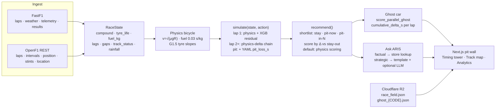
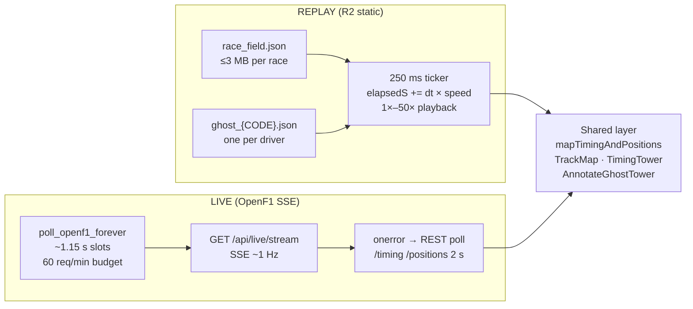

# ARIS — Adaptive Race Intelligence System

**Live at [arisf1.tech](https://arisf1.tech) · Beta**

An F1 race strategy simulator and pit-wall decision tool built on
real session data. Pick any driver from any 2024–2026 race, watch
the replay with a live timing tower and track map, and see how
ARIS's recommended strategy would have played out against the real
team's decisions.

[](https://github.com/AnassNadeem/ARIS/actions/workflows/ci.yml)
[](https://github.com/AnassNadeem/ARIS/actions)

---

## What it does

- **Replay mode** — every completed 2024, 2025, and 2026 race, with a
  live-feeling pit wall: timing tower, track map, tyre state, gap
  history, and sector colouring. Playback from 1× to 50× speed.
- **ARIS strategy** — a search-based recommender scores a fixed
  shortlist of pit/stay actions using a physics model, calls the
  best option at each decision point, and displays it as an ARIS
  timing-tower row showing the simulated gap vs the real driver.
- **Ask ARIS** — factual questions (who is leading, what tyres is
  X on, gap to leader) answered directly from live race state.
  Strategic questions (should I pit, why did ARIS recommend lap 28)
  answered from the last recommendation.
- **Live timing** — OpenF1 SSE feed during race weekends, same
  tower and map, without strategy (ARIS live strategist: coming soon).

---

## Honest numbers

| Metric | Value | Note |
|---|---|---|
| Dry strategy match-rate | **34.5% (30/87)** | vs stay-out baseline 27.6% |
| Never-pit baseline | 27.6% (24/87) | dead-simple benchmark |
| Blend lap-time MAE | 0.583 s | physics + XGB residual + MA(2) |
| MA(2) baseline MAE | **0.522 s** | MA(2) beats the blend |
| Lights-out pos. delta | −1.73 all / −1.49 clean / −2.38 disrupted | negative = ARIS better |
| Zandvoort 2026 identity | Pit L33 HARD · Pit L30 HARD · Stay out | locked regression test |

**What 87 means:** 87 scored decision inflections across 2024–2025
(pit stops, SC periods, compound changes), not 87 Grands Prix.

**Why the blend loses to MA(2):** the physics model carries a ~17 s/lap
absolute offset that does not affect ranking (ranking uses deltas),
but the MAE metric penalises it. MA(2) is a 2-lap moving average —
useful for smoothing but blind to tyre state. ARIS uses deltas for
ranking, not absolute times; this is why MAE is the wrong metric for
strategy quality.

---

## Architecture



### Key variables at each stage

| Stage | What flows through |
|---|---|
| FastF1 → ingest | `LapTime`, `Compound`, `TyreLife`, `TrackStatus`, `Rainfall`, `GridPosition`, `X/Y` GPS |
| RaceState fields | `compound`, `tyre_life`, `fuel_kg`, `lag1_pace`, `lag2_pace`, `gap_ahead_s`, `track_status`, `rainfall` |
| Physics → simulate | `slope × (tyre_life − 1)` + `0.03 × fuel_kg` + `pit_loss_s` |
| Simulate → recommend | `delta_vs_stay_out_s` (negative = faster than staying out) |
| Recommend → ghost | `pit_laps[]`, `compounds[]`, `cumulative_delta_s` per lap |
| Ghost → UI | `position`, `gap_to_leader_s`, `compound`, `tyre_life` per lap tick |

---

## Replay vs live data paths



Both paths produce identical `CarState` objects consumed by the
same tower and map components. The replay ticker emulates SSE
framing so all downstream code is path-agnostic.

---

## Physics model

**Bicycle model** (single-track, no aero, `src/aris/physics/bicycle.py`):

v_corner = min(√(μ·g·R), v_max) μ=1.5, g=9.81, v_max=92 m/s
t_lap = Σ corner_time + straight_time
+ slope × max(0, tyre_life − 1) ← G1.5 degradation
+ 0.03 × fuel_kg ← fuel penalty
+ pit_loss_s (if pitting, from circuit YAML)


**Tyre slopes** (G1.5, `src/aris/physics/tires.py`):

| Compound | s / lap of age |
|---|---|
| SOFT | 0.08 |
| MEDIUM | 0.05 |
| HARD | 0.03 |
| INTER | 0.04 |
| WET | 0.02 |

**Fuel:** 110 kg start, 1.7 kg/lap burn, 0.03 s/kg penalty. All three
are F1 rules-of-thumb, labelled as such in code.

**XGBoost residual:** trained to predict `actual − physics`. Features:
`compound_code`, `tyre_life`, `fuel_kg`, `lag1_pace`, `lag2_pace`,
`stint_roll3`, `physics_pred`. Applied on **remainder lap 1 only**;
subsequent laps use physics-delta chaining (residual dampened by
`min(1, |physics − lag1| / 8)`).

**Inverse-variance blend** (MAE evaluation only): physics+residual vs
MA(2) = 0.5 × (lag1 + lag2), weighted by rolling 8-lap MSE.
`simulate()` does not use this blend — it uses physics + lap-1
residual only.

**Sample pit-loss table** (full table in `data/tracks/*.yaml`):

| Circuit | pit_loss_s |
|---|---|
| Bahrain | 21.8 |
| Monaco | 19.2 |
| Silverstone | 18.7 |
| Zandvoort | 18.5 |
| Monza | 21.3 |
| Spa | 14.6 |
| Australia | 14.3 |
| Miami | 13.3 |

---

## Strategy recommender

`recommend()` scores a shortlist every time a trigger fires:

**Triggers:** lap 1 (always), tyre life at 25/50/75% of race distance,
gap ahead < 22 s (undercut window), gap ahead < 1 s (tactical), any
SC/VSC phase.

**Shortlist:** STAY_OUT · PIT_NOW (each available compound) ·
PIT_IN_{1,2,3,5,8} laps (each compound) · two-stop sketches if one
stop cannot cover remaining laps · LIFT/BRAKE corner options.

**Scoring:** `delta_vs_stay_out_s` from `simulate()`. Most negative
delta = best action. Stay-out is always kept on the list.

**What ARIS cannot see:** tyre temperatures, true Pirelli C-compound
specification, rival team strategy, hidden fuel loads.

**Match definition:** ARIS pit call within ±2 laps of team action,
same dry compound. Wet races, red-flag sessions excluded.

---

## Ghost car

The ARIS timing-tower row is a fully simulated car running ARIS's
recommended strategy from lights-out, scored against the real field.

**Per-lap simulation** (`src/aris/ghost.py::score_parallel_ghost`):

ghost_lap_s[L] = simulate(STAY_OUT, ghost_tyres).this_lap
real_lap_s[L] = simulate(STAY_OUT, real_tyres).this_lap
cumulative_delta_s[L] += ghost_lap_s − real_lap_s
(pit lap: + YAML pit_loss for the car that boxed)


**Timing-tower ranking** (`rank_ghost_by_gap`):

ghost_gap = max(0, real_gap_to_leader − cumulative_delta_s)
ghost_position = 1 + count(classified gaps strictly < ghost_gap)

When `cumulative_delta_s = 0` (ARIS plan identical to real),
ghost position equals the real driver's classified position.

**Previous bug (fixed):** old ranking summed raw lap times and froze
retired cars as permanent race leaders, placing the Miami 2026 ghost
P23 in a 22-car field. Replaced by gap-anchored ranking.

**Frontend playback** (`frontend-next/lib/ghostCar.ts`):

ghost_lap_s[L] = real_lap_s[L] − (delta[L] − delta[L−1])
ghost_cumulative_s[L] = Σ ghost_lap_s[1..L]
progress_within_lap = (elapsedS − cum[L−1]) / ghost_lap_s[L]
path_frac = wrap01(progress)

NaN laps (null FastF1 data) filled with median of finite ghost laps.

**R2 ghost file** (`ghost_{CODE}.json`): strategy header (pit_laps,
compounds, label) + per-lap ticks (position, gap_to_leader_s,
compound, tyre_life, cumulative_delta_s, aris_action).

---

## Data storage

| Store | Contents | Size |
|---|---|---|
| Cloudflare R2 | `race_field.json` + `ghost_{CODE}.json` per race per driver | ≤3 MB per race_field; tens of KB per ghost |
| Postgres (Neon) | sessions, drivers, laps, weather, results, aris_cache | ~years of ingested 2018–2026 sessions |
| FastF1 local cache | `.ff1pkl` per session (laps, weather, telemetry) | hundreds of MB on full machine |

Replay console reads **R2 only** — no Postgres during normal use.
Recommend and backtest read **Postgres** (ingested laps and weather).
Live timing reads **OpenF1 REST** via the Heroku SSE broker.

---

## What ARIS is not

| Claim | Reality |
|---|---|
| RL / learned policy | No. Search over a fixed shortlist, scored by a physics simulator. No online learning. |
| LLM strategy agent | No. The LLM (optional Ollama) narrates decisions; it never ranks actions. |
| Fitted tyre model | Partially. G1.5 slopes are F1 rules-of-thumb; circuit OLS overlays exist but are not the default. |
| Calibrated wet model | No. INTER/WET recommendations are labelled `[HEURISTIC]`. Only ~5 rain-heavy races in the training set. |
| Real-time ARIS strategy | Not yet. Live timing works; live strategy is "coming soon". |

---

## Repository layout

src/aris/ Core model — physics, simulator, recommender, ghost, eval
backend/ FastAPI broker — live SSE, replay packs, recommend API
frontend-next/ Next.js pit wall (production at arisf1.tech)
scripts/ Prebuild R2 replay packs, backtest, data tools
deploy/ R2 upload, Cloudflare Worker (legacy extra UI host)
apps/ Streamlit lap explorer — Phase 2, MA(2) accuracy canary
tests/ 561 Python test functions, 93 files
frontend-next/e2e Playwright e2e (ghost regression, live coming-soon)
data/tracks/ Per-circuit YAML (pit_loss_s, tyre slopes, corners)
docs/ Architecture notes, model status, ghost system, audit
learning/ Month-long no-AI derivation notes (maths/stats ownership)


---

## Getting started

```bash
# Python (uv recommended)
uv sync --extra dev
cp .env.example .env        # fill DATABASE_URL, R2 credentials, OPENF1_API_KEY

# Postgres
docker compose up -d        # or point DATABASE_URL at Neon/any Postgres

# Backend
uvicorn backend.main:app --reload

# Frontend
cd frontend-next
npm install
cp .env.example .env.local  # set NEXT_PUBLIC_API_BASE, NEXT_PUBLIC_R2_BASE_URL
npm run dev
```

See `DEPLOY.md` for Heroku + Cloudflare Pages deployment and
`CONTRIBUTING.md` for the test/lint workflow before opening a PR.

---

## Stack

**Backend:** Python 3.12 · FastAPI · FastF1 · XGBoost · Pydantic · SQLAlchemy · Postgres (Neon) · Heroku Basic  
**Frontend:** Next.js 14 (App Router) · Zustand · Recharts · Tailwind · Cloudflare Pages  
**Data:** Cloudflare R2 · OpenF1 REST · GitHub Actions (weekly rebuild)  
**Testing:** pytest (561 functions, CI-enforced) · vitest · Playwright e2e
