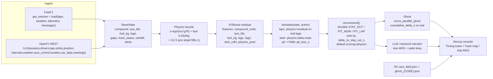
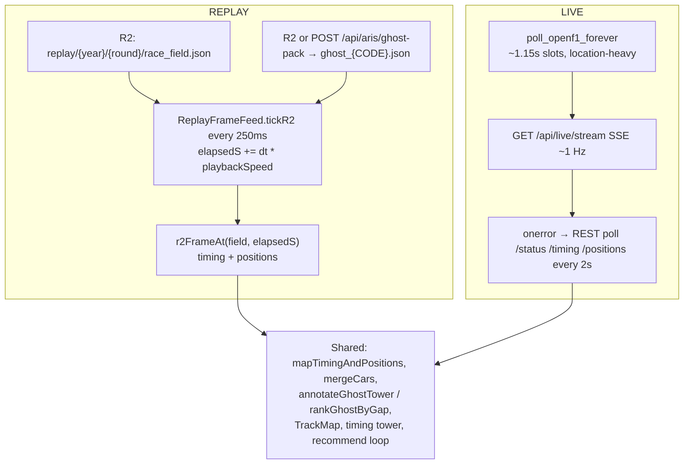

# ARIS README source material (audit draft)

**Not the public README.** Extracted from code on 2026-09-03. Accuracy over prose.
`docs/GHOST_CAR_SYSTEM.md` does not exist (use `docs/ARIS_GHOST_CAR_FIXES.md` and `docs/GHOST_CAR_REMEDIATION_PLAN.md`).

---

## Proposed Mermaid 1 — full data flow



Key variables between boxes:

| Edge | Variables |
|---|---|
| FastF1 → ingest | `laps` (LapTime, Compound, TyreLife, sectors, TrackStatus, PitIn/Out), `weather_data` (AirTemp, TrackTemp, Humidity, Rainfall, Time), `results` (Abbreviation, FullName, TeamName, GridPosition, Position, Points), `pos_data` / telemetry (X,Y,Z, Speed, …), `messages` (Time, Lap, Flag, Category, Message) |
| OpenF1 → live RaceState / tower | `lap_duration`, `duration_sector_*`, `compound`, `tyre_age_at_start`, `gap_to_leader`, `interval`, `position`, `x,y`, `rainfall`, `air_temperature`, `track_temperature` |
| RaceState → physics | `compound`, `tyre_life`, `fuel_kg`, `country`/`year`/`round_no` (slopes + pit_loss) |
| Physics → residual | `physics_pred` plus lag features |
| simulate → recommend | `PredictedOutcome.total_race_time_s`, `delta_vs_stay_out_s` |
| recommend → ghost | top strategy `pit_laps` / `pit_compounds` / stay-out |
| ghost → UI | `cumulative_delta_s`, `position`, `gap_to_leader_s`, derived `ghost_lap_s` |

---

## Proposed Mermaid 2 — REPLAY vs LIVE



---

## Exact R2 tree (code, not a live listing)

```
replay/{year}/{round_number}/
  race_field.json          # ≤ MAX_FIELD_BYTES = 3 MiB (thinned from 2 Hz pos_samples)
  ghost_{CODE}.json        # one file per baked driver, e.g. ghost_VER.json
```

`race_field.json` keys (`scripts/prebuild_race_r2.py::build_race_field`):

```
meta: year, round, session_type="R", circuit_name, total_laps, date_race, green_flag_s, session_key, outline_source
outline: { x[], y[] }  (map polyline)
drivers: [{ code, ... }]
laps: [{ driver, lap, lap_time_s, sectors, compound, tyre_life, position, track_status, pit flags, ... }]
stints: [{ driver, compound, lap_start, lap_end, ... }]
weather: samples
race_control: [{ date, flag, category, message, lap_number }]
pos_samples: { DRIVER: [{ lap_frac, path_frac, ... }] }  # 2 Hz then thinned 1 / 0.5 / 0.25 / 0.125 Hz
```

Typical sizes: **not measured in-repo**. Cap is 3 MiB per `race_field.json`. Ghost JSON is a strategy + per-lap ticks (typically tens of KB). Total volume ≈ (number of completed 2024–2026 races) × (field + N ghosts) — **manual: count objects in the bucket**.

Public base (code default): `https://pub-9429cde26be84c4c8034f0b5873b9a7d.r2.dev`

---

# SECTION A — DATA INGEST LAYER

## A1. FastF1 API calls for a race session

**Postgres ingest** (`src/aris/io/ingest.py::_load_session`):

```python
sess = fastf1.get_session(year, event, session_type)
sess.load(laps=True, telemetry=with_telemetry, weather=with_weather, messages=False)
```

Default ingest: `telemetry=False`, `weather=True`, `messages=False`.

**Replay / API session load** (`backend/sessions.py::load_session`):

```python
sess = fastf1.get_session(year, round_number, stype)  # 2026: event name from calendar first
sess.load(laps=True, telemetry=tel, weather=wx, messages=msg)
```

Defaults: `telemetry=False`, `weather=True`, `messages=False`. Replay year must be in `ALLOWED_REPLAY_YEARS` (2024–2026). Open live race/sprint sessions are refused.

**Feature / residual training** (`src/aris/io/fastf1_session.py::load_race_session`):

```python
session = fastf1.get_session(year, gp, "R")  # or reconstruct Session from pickle cache
session.load(laps=laps, weather=weather, telemetry=telemetry, messages=messages)
```

What `load()` populates (objects actually read in this repo):

| Argument | FastF1 object | Used for |
|---|---|---|
| `laps=True` | `sess.laps` (Laps dataframe) | ingest, replay, features, ghost field |
| `weather=True` | `sess.weather_data` | rainfall, temps |
| `telemetry=True` | per-lap `get_telemetry()` / `get_car_data()` / `get_pos_data()`; `sess.pos_data` | GPS map, telemetry table |
| `messages=True` | `sess.messages` | race control / quali windows |
| (always after get_session) | `sess.results`, `sess.event`, `sess.date`, `sess.total_laps` | drivers, round, country |

## A2. Fields extracted

### Laps (`sess.laps`)

**Ingest → Postgres `laps`** after `detect_stints()`:

| Stored column | FastF1 / derived source |
|---|---|
| `lap_time_s` | `LapTime` → `LapTimeS` (seconds) |
| `compound` | `Compound` |
| `tyre_life` | `TyreLife` |
| `stint` | `StintId` from `aris.physics.stint.detect_stints` (FastF1 `Stint` if present, else compound-change ∪ pit-out cumsum) — **not** raw FastF1 `Stint` name |
| `sector_1_s` / `_2` / `_3` | `Sector1Time`, `Sector2Time`, `Sector3Time` |
| `track_status` | `TrackStatus` |
| `pit_in` / `pit_out` | `PitInTime` / `PitOutTime` notna |
| `rainfall` | nearest weather sample at `LapStartTime` (`aris.physics.wet.nearest_rainfall`) |
| identity | `Driver`, `LapNumber` |

Also used in ingest: `Driver` unique codes; `results` join.

**API `session_laps`** (`backend/sessions.py`) additionally reads:

`IsPersonalBest`, `Position`, `Time` (as `end_time_ms`), `SpeedI1`, `SpeedI2`, `SpeedFL`, `SpeedST`, `Team`.

**Stint detection extras on the frame:** `LapTimeS`, `CompoundChange`, `StintId`. FastF1 `Stint` used when present.

### Weather (`sess.weather_data`)

| Field | Use |
|---|---|
| `Rainfall` | boolean; session any() → `session_weather.rainfall`; per-sample → `weather_samples`; per-lap nearest |
| `AirTemp` | median → `air_temp_c`; API also mean/min/max |
| `TrackTemp` | same → `track_temp_c` |
| `Humidity` | median → `humidity_pct`; API series |
| `Time` | sample `time_s` |
| `WindSpeed`, `WindDirection` | API weather series only (not Postgres ingest summary) |

### Race control (`sess.messages`)

Fields: `Time` or `Utc`, `Lap`, `Flag`, `Category`, `Message`.

Values that matter: flags/categories for SC/VSC/red; message text for DNF/DNS in live OpenF1 (see live). FastF1 `TrackStatus` on **laps** is the strategy SC signal: codes `4` SC, `6` VSC, `7` VSC ending (`state.py::_SC_VSC_CODES`). Red flag `5` → walk-forward `divergence_insufficient_info`.

### Position / telemetry

**Ingest telemetry** (`lap.get_telemetry()`): `Speed`, `Throttle`, `Brake`, `nGear` (clamped 1–8), `DRS`, `RPM`, `X`, `Y`, `Z`.

**API telemetry** (`get_car_data().add_distance()` + `get_pos_data()`): `Distance`, `Speed`, `Throttle`, `Brake`, `DRS`, `RPM`, `nGear`, pos `X`,`Y`.

**Map / replay GPS** (`sess.pos_data` or `get_pos_data()`): `X`, `Y`, `Time` (nearest sample to lap `Time`).

### Driver info

From `sess.results`: `Abbreviation` → code, `FullName`, `TeamName`. From laps: unique `Driver`. Results also: `GridPosition`, `Position` (finish), `Points`, `Time`, `Status`, `Laps`, `FastestLapRank`.

### Stints

- Ingest: stint id on each lap row (`StintId`), not a separate FastF1 stints table.
- API `session_stints`: derived by grouping laps on pit-out or compound change.
- OpenF1 live: dedicated `/stints` endpoint (below).
- `RaceState.stints`: `{driver_code: [{lap_start, compound}]}` from Postgres laps compound changes.

## A3. OpenF1 live ingest (`backend/live.py`)

Base: `https://api.openf1.org/v1` via `_openf1(path, params)`.

| Endpoint | Params | Fields consumed | Becomes |
|---|---|---|---|
| `sessions` | `session_key=latest` or `year=` or `session_key=` | session_key, type/name, dates | attach live session |
| `meetings` | `year=` | meeting metadata | round matching |
| `drivers` | `session_key` | driver_number → name_acronym / code, colours | `LiveTimingRow.driver_code`, team_colour |
| `position` | `session_key`, optional `date>` | `driver_number`, `position` | tower position |
| `intervals` | `session_key` | `gap_to_leader`, `interval` | `gap_to_leader_s`, `gap_to_ahead_s` |
| `laps` | `session_key` | `driver_number`, `lap_number`, `lap_duration`, `duration_sector_1/2/3`, `segments_sector_*`, `st_speed`, `tyre_life`, dates | last lap, sectors, speed trap; lag pace for live RaceState |
| `stints` | `session_key` | `driver_number`, `compound`, `tyre_age_at_start`, `lap_start`, `stint_number` | compound letter, tyre_life, pit_count |
| `weather` | `session_key` | `rainfall`, `air_temperature`, `track_temperature`, `humidity`, `wind_speed`, `wind_direction`, `pressure` | `LiveWeatherResponse`; rainfall → live rain flag |
| `race_control` | `session_key` | `message`, `flag`, `category` | session flag; DNF/DNS from message keywords |
| `location` | `session_key`, `date>` | `driver_number`, `x`, `y`, `date`, `status` | map GPS; pit if status pit/inpit |
| `car_data` | `session_key`, `date>` | `throttle`, `brake`, `speed`, `drs`, `driver_number` | live car widgets |

**RaceState from OpenF1** is not a full field snapshot. `backend/aris_api.py::build_live_aris_state` builds a **synthetic** `RaceState`: compound often `"MEDIUM"`, `tyre_life=lap`, `track_status="1"`, lags from HAM (or similar) `lap_duration` list, gaps from intervals. Comment in code: strategy ignores this driver's real stints. Production recommend prefers Postgres `build_race_state` / FastF1 fallback first (`build_race_state_with_fallback`).

## A4. RaceState (`src/aris/state.py`)

Pydantic model. Every field:

| Field | Type | Meaning |
|---|---|---|
| `session_id` | int | Postgres session PK (0 if synthetic) |
| `driver_id` | int | Postgres driver PK |
| `driver_code` | str | 3-letter code |
| `driver_name` | str | Full name |
| `team` | str \| None | Constructor |
| `year` | int | Season |
| `round_no` | int | Calendar round |
| `country` | str | Track lookup key (e.g. Netherlands) |
| `lap_number` | int | Current lap (clamped to available) |
| `compound` | str | Tyre on car (SOFT/MEDIUM/HARD/INTERMEDIATE/WET) |
| `tyre_life` | int | Laps on this set |
| `fuel_kg` | float | `estimate_fuel_kg`: start 110 kg, burn 1.7 kg/lap |
| `laps_remaining` | int | `total_laps - lap_number` (max 0) |
| `total_laps` | int | Default 57; from track YAML |
| `track_name` | str | Default Bahrain |
| `gap_to_leader_s` | float \| None | Classified gap to P1 |
| `gap_ahead_s` | float \| None | Gap to car ahead |
| `gap_behind_s` | float \| None | Gap to car behind |
| `position` | int \| None | Classified position |
| `undercut_threat` | bool | `0 < gap_ahead_s < 22` |
| `pit_compound` | str | Default HARD; 2025+ may infer from stint history |
| `pirelli_allocation` | list[str] | Dry compounds nominated |
| `lag1_pace` | float \| None | Previous completed lap time (s) |
| `lag2_pace` | float \| None | Two laps ago |
| `stint_roll3` | float \| None | Mean of last up to 3 prior laps |
| `air_temp_c` | float \| None | Session weather |
| `track_temp_c` | float \| None | Session weather |
| `track_status` | str \| None | FastF1 TrackStatus string |
| `recent_sc_pace` | bool | Current or last 1–2 lag laps SC/VSC |
| `confidence_caveat` | str \| None | SC pace caveat text |
| `lap_note` | str \| None | Missing-lap clamp message |
| `gap_ahead_history` | list[float] | Last 5 completed gaps ahead |
| `rainfall_mm_per_lap` | float \| None | Unused in build (always None from DB path) |
| `weather_rainfall` | bool \| None | Session-level any-rain bit |
| `rainfall` | bool | Per-lap rain |
| `stint_number` | int | From laps.stint |
| `p_sc_next_5_laps` | float | Default 0.07 |
| `p_sc_next_10_laps` | float | Default 0.12 |
| `track_state` | str | DRY/DAMP/CROSSOVER/WET/DRYING |
| `track_state_confidence` | float | Default 0.95 |
| `formation_lap` | bool | FSM |
| `standing_start` | bool | FSM |
| `stints` | dict | Per-driver `{lap_start, compound}` lists |

Overrides: `RaceStateOverrides` (compound, tyre_life, fuel_kg, gaps, position, pit_compound).

---

# SECTION B — PHYSICS / LAP TIME PREDICTION

## B1. Bicycle model (`src/aris/physics/bicycle.py`)

Single-track, no aero. Core:

```
a_lat_max = mu * g                    # mu=1.5, g=9.81
v_corner  = min(sqrt(mu * g * R), v_max)   # v_max = 92 m/s
t_corners = Σ (arc_length_i / v_corner_i)
# Each of n corners gets straight_length/n of lumped straight:
# trapezoid accel/cruise/brake with accel = a_lat_max
t_physics = t_corners + n * t_straight_segment
t_lap     = t_physics + 0.03 * fuel_kg + (pit_loss if pit_lap) + tire_pace_loss(...)
```

Variables: `Car.mu`, `Car.max_speed_ms`, `Corner.radius_m`, `Corner.arc_length_m`, `Track.straight_length_m`, `StintState.fuel_kg`, `StintState.compound`, `StintState.lap_in_stint`.

## B2. G1.5 tyre slopes (`src/aris/physics/tires.py::DEFAULT_COMPOUND_SLOPE`)

```
tire_pace_loss = slope * max(0, lap_in_stint - 1)
               + (1.5 s if lap_in_stint == 1 else 0)   # OUT_LAP_PENALTY_S
               + compound_pace_offset                   # SOFT −0.40, MEDIUM −0.30 (or circuit), HARD 0
```

| Compound | Slope s/lap of age |
|---|---|
| SOFT | **0.08** |
| MEDIUM | **0.05** |
| HARD | **0.03** |
| INTERMEDIATE | **0.04** |
| WET | **0.02** |

Shipped path uses these unless FP2 weekend cal / `ARIS_USE_CIRCUIT_DEG=1` / `ARIS_TRUE_COMPOUND_SLOPES`. G1.5 constants are never mutated in code.

## B3. XGBoost residual (`src/aris/models/residual.py`, `predict.py`, `features.py`)

**Predicts:** `residual = actual_lap_time − physics_pred` (seconds). At inference: `physics + residual` (after damp).

**Features `FEATURE_COLS`:** `compound_code`, `tyre_life`, `fuel_kg`, `lag1_pace`, `lag2_pace`, `stint_roll3`, `physics_pred`.

`compound_code`: SOFT=0, MEDIUM=1, HARD=2, INTERMEDIATE=3, WET=4.

**Damp:** `scale = min(1, |physics − lag1| / 8.0)` so residual shrinks when physics already matches pace.

**Inverse-variance blend** is **not** physics vs XGB. It is **physics+residual vs MA(2)** (`blend_physics_residual_with_ma2`):

```
MA(2) = 0.5 * (lag1 + lag2)
var_i = rolling MSE of last 8 signed errors (min 3 obs, fallback var 1.0)
y_hat = (w_r * pred_residual + w_m * pred_ma2) / (w_r + w_m)
w = 1/var
```

Used in **held-out MAE eval** (`predict_blended_frame`), not inside `simulate()` / `recommend()`. Simulate uses `predict_lap_time` = physics + (optional residual) on the **first** lap only.

If `models/residual_xgb.json` missing or `lag1_pace` is None → physics only.

## B4. `simulate(state, action)` (`src/aris/simulate.py`)

**Inputs:** `RaceState` + `StrategyAction` (`kind`: stay_out / pit_now / pit_lap / lift / brake; `pit_lap`, `pit_compound`, optional `pit_laps`+`pit_compounds`, corner_index, distance_m). Optional: `pace_noise`, `dirty_air_penalty`, `deg_multiplier`, `fuel_deg_correction`.

**First lap:** `predict_lap_time` with **real** lag1/lag2/roll3 (physics + residual).

**Subsequent laps:** `pred = prev_pred + (physics_this − physics_prev)` — chained **physics delta** only (tyre slope + fuel in bicycle). Fuel-deg correction subtracts `0.03 * fuel_kg` from physics used in that delta so fuel burn does not mask tyre drop.

**Pit:** in-lap = green pred + `get_pit_loss(YAML pit_loss, track_status)` + wet-on-dry penalty; then compound reset, `tyre_life_eff = 1`. SC/VSC multiplier only if pit lap == snapshot lap (unless analysis `pit_status_by_lap`). Do not also set `pit_lap=True` on physics (would double-count).

**Returns:** `PredictedOutcome`: `action`, `total_race_time_s`, `delta_vs_stay_out_s` (vs stay-out remainder), `mean_lap_time_s`, `laps_simulated`, `evidence`, extrapolation fields.

**Circuit pit-loss YAML** (`data/tracks/*.yaml` `pit_loss_s`), sample of 8:

| Circuit | pit_loss_s |
|---|---|
| Bahrain | 21.8 |
| Netherlands / Zandvoort | 18.5 |
| Australia | 14.3 |
| Monaco | 19.2 |
| Italy / Monza | 21.3 |
| Belgium / Spa | 14.6 |
| Britain | 18.7 |
| Qatar | 23.0 |

(Also: Miami 13.3, Canada 16.1, Japan 21.6, USA 20.1, Singapore 15.8, … full table in those YAML files / `frontend-next/lib/r2Replay.ts::PIT_LOSS_BY_CIRCUIT`.)

## B5. Fuel correction

```
FUEL_START_KG = 110.0
_FUEL_BURN_PER_LAP = 1.7
estimate_fuel_kg(lap) = max(0, 110 − 1.7 * (lap − 1))
FUEL_PENALTY_S_PER_KG = K_FUEL_S_PER_KG = 0.03
fuel_correction_s(fuel_kg) = 0.03 * max(0, fuel_kg)
```

Bicycle **adds** `0.03 * fuel` to absolute lap. Remainder chaining **subtracts** the same term from physics so degradation ranking is not fuel-dominated (`fuel_deg_correction=True` default).

---

# SECTION C — RECOMMENDER

## C1. Candidate shortlist (`_candidate_actions`)

Always:

1. `STAY_OUT`
2. `PIT_NOW` for each `_get_available_compounds(state)` (dry Pirelli set; INTER/WET by track_state)
3. `PIT_LAP` at `lap_number + {1,2,3,5,8}` × each compound (if ≤ total_laps)
4. Two-stop sketches **only if** one-stop cannot cover remaining (`MAX_REALISTIC_STINT_LAPS=38`):  
   - pits `[total//2, total-8]` compounds `MEDIUM, HARD`  
   - pits `[total//2-5, total//2+10]` compounds `SOFT, HARD`  
   each stint ≥ `MIN_STINT_LAPS=15`
5. Line: `LIFT` 30 m into T1, T7, T10; `BRAKE` 20 m earlier into same corners

Also: overcut candidates if `ARIS_FIELD_OVERCUT=1` and field present. Wet lock: `should_stay_on_wet` replaces dry list with stay + hold 3/5/8 + optional WET pit. Extra INTER/WET `PIT_NOW` if rain heuristic fires.

Compound suppression: drop SOFT if remaining ≥ 15 and track_temp ≥ 20; drop MEDIUM if remaining ≥ 25, HARD available, track_temp > 25.

## C2. Triggers (`src/aris/engine/triggers.py`)

| Trigger | Condition |
|---|---|
| CONFIRM_STRAT | **Lap 1** new lap, once |
| SC | `track_status` not in `{"1","None"}` (any non-green, including yellow) once per lap |
| APPROACHING_WINDOW | tyre_life in `[frac*total_laps − 5, frac*total_laps)` for frac **0.25, 0.50, 0.75**; each frac once per race |
| PIT (life %) | `tyre_life / total_laps ≥ 0.25, 0.50, 0.75` (keyed per lap) |
| PIT (undercut) | `undercut_threat` i.e. `0 < gap_ahead < 22` |
| TACTICAL | `gap_ahead_s < 1.0` |
| FIELD board | lap 1 or every 10 laps — informational, not `recommend()` |

UI loop (`useArisRecommendLoop`): also lights-out, pit windows, driver change, “Get strategy”. Production HTTP recommend uses `mc_draws=0` (`backend/aris_api.py`).

## C3. Scoring

`recommend(..., scoring="physics"|"cql"|"blend", cql_weight=0.5)`.

- **Default `"physics"`:** `rank_score = delta_vs_stay_out_s` (simulate + optional MC if `mc_draws>0` and not gated).
- CQL: `rank_score = cql_q_delta` if model loads.
- Blend: `(1-w)*physics_delta + w*cql_q_delta`.

CQL gate failed (6/87); best blend ties 30/87. **Shipped default stays physics.** `ARIS_USE_MC=1` can re-rank top with MC; backtest and API use `mc_draws=0`. Library default `DEFAULT_DRAWS=100` if caller omits (would run MC) — **API explicitly passes 0**.

## C4. Output structure

`RecommendationResult`: `state_lap`, `driver_code`, `compound`, `recommendations: list[Recommendation]`.

One `Recommendation` (Zandvoort identity fixture, `mc_draws=0`):

```json
{
  "rank": 1,
  "label": "Pit lap 33 for HARD",
  "action": {
    "kind": "pit_lap",
    "pit_lap": 33,
    "pit_compound": "HARD",
    "pit_laps": null,
    "pit_compounds": null,
    "corner_index": null,
    "distance_m": null
  },
  "delta_vs_stay_out_s": "<float, remaining-race vs stay-out; more negative = better>",
  "mean_race_time_s": "<simulate total>",
  "confidence_std_s": 0.0,
  "p10_delta_s": "<may be overwritten by conformal>",
  "p90_delta_s": "<same>",
  "evidence": "pit L33->HARD",
  "narration_context": {
    "driver": "VER",
    "lap": 25,
    "compound": "MEDIUM",
    "tyre_life": 2,
    "laps_remaining": 47,
    "strategy": "Pit lap 33 for HARD",
    "delta_s": "<rounded>",
    "undercut_bonus_s": 0.0,
    "undercut_source": "none"
  },
  "tactical": null,
  "wet_heuristic": false,
  "cql_q_delta": 0.0,
  "rank_score": "<same as delta after physics sort>",
  "confidence_note": null
}
```

Exact numeric deltas: **run** `python scripts/backtest.py --zandvoort-identity` / `tests/test_circuit_deg.py::test_zandvoort_identity_flag_off` — labels are locked; floats are not hardcoded.

HTTP `RecommendResponse` is a **flattened** BOX/STAY_OUT mapping (`frontend-next/lib/arisRecommend.ts::mapRecommendResponse`), not the full top-3 list.

## C5. Dry match-rate 0.345 (30/87)

**Source of definition:** `src/aris/eval/backtest.py`.

- Walk 2024+2025 ingested races, **reference driver ≈ classified P5**.
- `extract_inflections`: pit-in laps, SC/VSC period starts, compound changes not tied to a pit.
- At each inflection, `recommend()` rank-1 vs team action.
- **Match:** `matches_team_action`: if team pitted, ARIS pit call within **±2 laps** (`PIT_LAP_TOLERANCE`) and same dry compound; if team stayed, ARIS stay-out.
- Else hindsight: if ARIS sim ≥ 2 s faster than team sim → `divergence_aris_hindsight`; else `divergence_team_hindsight`.
- **Excluded** (`divergence_insufficient_info`): TrackStatus contains `5` (red); session `weather.rainfall` or wet compound (unless `--include-wet`).
- `match_rate` = n(`classification=="match"`) / n(scored ≠ insufficient_info).

**87 is scored inflections, not 87 races.** Docs: 2024 **15/40**, 2025 **15/47**, combined **30/87**. Stay-out baseline **24/87 = 0.276**.

Exact race list of the 87: **not a static file** — product of ingested DB + rainfall/red filter. Manual: last `results/backtest/` JSONL.

---

# SECTION D — GHOST CAR

## D1. `ghost_lap_s` (frontend, replay)

`frontend-next/lib/r2Replay.ts::deriveGhostLapTimes`:

```
delta[0] := 0
step[L]  := cumulative_delta_s[L] − cumulative_delta_s[L-1]
ghost_lap_s[L] := real_lap_s[L] − step[L]
```

Then clamp if `ghost_lap_s > 300` (red-flag) for playback; negatives kept and listed in `implausible_laps`. **Do not add pit_loss again** (already in delta on pit laps).

Engine-side per-lap sim (`advance_ghost_lap`): `ghost_lap_s = simulate(STAY_OUT on ghost tyres).this_lap`; `real_lap_s` same on real state; pit adds YAML pit loss to the car that boxed.

## D2. `ghost_cumulative_s`

```
ghost_cumulative_s[0] = 0
ghost_cumulative_s[L] = Σ ghost_lap_s[1..L]
```

**NaN guard:** NaN `ghost_lap_s` filled with **median of finite positive** ghost laps (else median real laps, else 90). If `cum + step` is not strictly increasing, add `fill` (or 1e-3) instead of propagating a stall.

## D3. Ghost `path_frac` (map)

`ghostPlaybackAt`: find lap L such that `elapsedS` is in `[cum[L-1], cum[L])`; `progress = T / span` with `T = elapsedS − cum[L-1]`; **`path_frac = wrap01(progress)`** (progress within current lap only). Comment: lights-out on S/F (`0`); GPS wrap ~0.97 must not place ghost off grid.

**`ghostStartFrac` is on the input type and diagnostics but is not added in `ghostPlaybackAt` body.** Real cars use `gridPathFrac(gridPosition) = wrap01(0 − (slot−1)*0.0035)` and blend until `lapFrac ≥ 0.02 + 0.035`.

Pit hide: from `cum[pitLap-1] + 0.84 * ghost_lap_s[pitLap]` for duration `pit_loss_s`.

## D4. Timing tower position

Preferred: `rank_ghost_by_gap` (`src/aris/ghost.py`) / `annotateGhostTower` (`mapCars.ts`).

```
ghost_gap = max(0, real_gap_to_leader − cumulative_delta_s)
position  = 1 + count(real classified gaps strictly < ghost_gap)
```

When delta=0, ghost_gap equals the real driver’s gap → same classified position.

## D5. `rank_ghost_by_gap` vs old ranking

**New:** classified `gap_to_leader_s` snapshot per lap (`field_gap_snapshot_by_lap`). DNFs excluded.

**Old (`_rank_ghost_in_field` + `field_cumulative_by_lap`):** sort by summed lap times. A retired car’s cumulative **freezes** and looks like the leader forever (Miami 2026 ghost P23). Also compared raw simulate absolute time (lap-1 cold start ~97 s vs field ~74 s → wrong rank even with delta 0). Legacy still used if `field_gap_by_lap` missing (live.py comment).

## D6. `ghost_{CODE}.json` (`r2_ghost_tick` + `ghost_pack.compute_ghost`)

Top-level:

| Field | Type | Meaning |
|---|---|---|
| `driver` | str | Code |
| `strategy.pit_laps` | int[] | ARIS planned stops |
| `strategy.compounds` | str[] | Compounds for those stops |
| `strategy.label` | str | e.g. Pit lap 33 for HARD |
| `ticks` | array | Per-lap tower state |
| `outcome.aris_action` | str | Last tick / plan |
| `outcome.real_action` | str | Last real action |
| `outcome.verdict` | str \| null | ARIS_CORRECT / INCORRECT / INCONCLUSIVE |

Each tick:

| Field | Type | Meaning |
|---|---|---|
| `lap` | int | Lap number |
| `position` | int | Ranked ghost position |
| `gap_to_leader_s` | float | Anchored gap |
| `compound` | str | Ghost tyre |
| `tyre_life` | int | Ghost tyre age |
| `stint` | int | 1 + pits completed |
| `cumulative_delta_s` | float | Positive ⇒ ghost (ARIS) ahead of real |
| `aris_action` | `"PIT"` \| `"STAY_OUT"` | This lap |
| `aris_confidence` | float 0–1 | Default 1.0 |

---

# SECTION E — REPLAY VS LIVE

## E1. Replay path

1. `ReplayFrameFeed.connect` → `tryR2` first if `NEXT_PUBLIC_R2_BASE_URL` / `/r2replay`.
2. Fetch **`race_field.json`** (`fetchRaceField`). Then **`ghost_{CODE}.json`** (`fetchGhost`: R2 then `/api/aris/ghost-pack`).
3. If R2 miss: FastF1 replay pack (`POST` init / pack-status / `replay-frame`) — slower path.
4. Ticker: `setInterval(..., 250)` ms. If playing: `elapsedS += (wall_dt_s) * playbackSpeed`. Speeds: **1, 2, 4, 8, 16, 25, 50** (`PlaybackControls`). Frame = `r2FrameAt(field, elapsedS, lastTickLapFrac)` → fake SSE-shaped `{status, timing, weather, positions}`.
5. Apply via same `applyPayload` as live (mapTimingAndPositions, applyGhost).

## E2. Live path

1. `LiveSseFeed.connect` → `EventSource(${API_BASE}/api/live/stream)`.
2. Backend `poll_openf1_forever`: sleep **1.15 s** per slot; 4/5 slots poll `location`; every 5th rotates car_data / position / laps / race_control / intervals / stints. Stay under 60 req/min.
3. SSE: handshake comment + stub seq=0; then `sse_build_payload` ~**1 s** if `is_live` else **2 s**. Payload: `seq`, `last_updated`, `full`, `status`, `timing`, `weather`, `positions` (delta-slim after first full).
4. Frontend `onmessage` → `applyPayload`. Laps/stints REST every **5 s**.
5. `onerror`: close ES, **poll REST every 2 s** (`/api/live/status`, `/timing`, `/positions`).

## E3. Shared between replay and live

- `mapTimingAndPositions`, `mergeCars`, `timingFingerprint`
- `annotateGhostTower` / `rankGhostByGap`
- Track map animator / tower components
- `applyGhost` in `liveFeed.ts`
- `POST /api/aris/recommend` loop (when ARIS on; live ARIS currently gated “coming soon” per ghost remediation doc)
- Circuit outline / path_frac display helpers (`timingPath.ts`) for real cars

---

# SECTION F — DATA STORAGE

## F1. Cloudflare R2

See tree above. Typical `race_field.json` ≤ 3 MiB after GPS downsample. Ghost files per driver. **Total bucket bytes: not in code.**

## F2. Postgres (Neon)

Tables:

| Table | Contents |
|---|---|
| `sessions` | year, round_no, country, session_type, date |
| `drivers` | code, year, full_name, team |
| `laps` | lap times, compound, tyre_life, stint, sectors, track_status, pit_in/out, rainfall |
| `telemetry` | optional per-sample GPS/car (not bulk-filled) |
| `session_weather` | session median temps + any-rain |
| `weather_samples` | timed rainfall/temps |
| `session_results` | grid, finish, points |
| `strategy_feedback` | logged decisions |
| `aris_cache` | app cache blobs (replay packs, HTTP), not FastF1 files |

**Normal replay console:** primarily **R2**, not Postgres. **Recommend / backtest / ingest:** `fetch_laps`, `fetch_all_laps`, `fetch_session_weather`, `fetch_weather_samples`, `fetch_session_results`, `fetch_drivers`, `fetch_race_session_id`. Live recommend may ingest via `ensure_session_ingested` if session closed.

## F3. FastF1 local cache

Path: repo `fastf1_cache/` (`ingest.py`, `fastf1_session.py`). Layout `{year}/{date}_{Event}/..._Race/*.ff1pkl` including `weather_data.ff1pkl`.

**Typical size: not quantified in code** (can be hundreds of MB–GB). Cold start: `sess.load` hits FastF1 HTTP; schedule miss reconstructs Session from pickles (`_session_from_cache`). Ephemeral dyno: load retry on corrupt pickle.

## F4. GitHub Actions `prebuild-race-r2`

File: `.github/workflows/prebuild_race.yml`.

- **Schedule:** Monday 18:00 UTC (`0 18 * * 1`)
- Also: `workflow_dispatch` (force rebuild), push to `main` on ghost/simulate/prebuild paths
- Runs `scripts/prebuild_race_r2.py --all-completed [--skip-existing]` then `deploy/r2_upload.py --path replay/`
- Uploads `race_field.json` + `ghost_*.json` to R2. Uses `DATABASE_URL` / FastF1 as needed.

---

# SECTION G — PERFORMANCE NUMBERS

| Claim | Code / artefact | Verdict |
|---|---|---|
| Dry match-rate **0.345 (30/87)** | `docs/model-status.md`; `scripts/backtest.py` comments; definition in `eval/backtest.py` | **Definition confirmed.** Latest JSONL of a T2 walk **not re-run this audit**. API `model_stats()` currently hardcodes **match_rate=0.325** and **`28/87 dry`** — **stale vs 0.345**. |
| Never-pit / stay-out **0.276** | `stay_out_baseline_rate`; docs 24/87 | **Confirmed in docs/eval.** API `never_pit_baseline=0.250` is **wrong vs 0.276** (older 10/40 2024-only). |
| Blend MAE **0.583 s** | `results/heldout-laptime-mae.csv` OVERALL `e3_blended_mae_s=0.582858` | **Confirmed** (round 0.583). Measured vs actual clean-ish lap times on **2024 HELD_OUT_RACES** calendar, inverse-variance blend of physics+residual vs MA(2). |
| MA(2) MAE **0.522 s** | same CSV `baseline_mae_s=0.522163` | **Confirmed.** **Beats ARIS blend.** Also physics-only E3 **17.378 s**; physics+residual **0.948 s**. |
| Lights-out Δ **−1.73 / −1.49 / −2.38** | `docs/model-status.md`; `aris_api.model_stats`; `bias_cancelled_delta` | **Sign: negative = ARIS better** (`aris_time_rank − actual_time_rank`). Not FIA points. `adjusted = actual_time + (ARIS_sim − team_sim)` then re-rank. All 48 / clean n=35 / disrupted n=13 (red or SC run ≥5). **Not re-simulated this audit.** |
| Zandvoort identity Pit 33 HARD / Pit 30 HARD / Stay | `tests/test_circuit_deg.py::test_zandvoort_identity_flag_off`; `scripts/backtest.py::run_zandvoort_identity` | **Still the locked default** (G1.5, `ARIS_USE_CIRCUIT_DEG` off). State: 2025 R15 Netherlands, VER, lap 25, MEDIUM life 2, 72 laps, lags 74 s. Flag-on circuit OLS **moves** labels (not shipped). |

CSV OVERALL row (authoritative MAE):

`OVERALL baseline_mae_s=0.522163 e3_physics_only=17.378467 e3_physics_residual=0.948102 e3_blended=0.582858`

---

# Gaps — not found in code (needs Anas)

1. Exact **list of 87 scored inflections** (race × driver × lap) — generated, not checked in.
2. **Measured R2 total GB** and typical `ghost_*.json` bytes.
3. **FastF1 cache size** on a full 2018–2026 workstation.
4. Numeric **Zandvoort remaining-race times** (labels yes; HARD vs MEDIUM seconds from last local run).
5. `docs/GHOST_CAR_SYSTEM.md` missing.
6. Whether production Cloudflare still serves Vite `frontend/` vs `frontend-next` (remediation doc flags this).
7. Live OpenF1 → full `RaceState` mapping for every field: **incomplete by design** (synthetic live ARIS state).

---

# Surprises / honesty notes for the README

1. **87 events = inflections**, not 87 Grands Prix.
2. **IV blend is vs MA(2), not vs bicycle**; `simulate()` does **not** use the blend.
3. **XGBoost residual only on lap 1** of a remainder; later laps are physics-delta. That is why chained MAE grows (documented G1.1).
4. **API `/model_stats` disagrees** with locked README numbers (0.325 / 28/87 / 0.250 never-pit).
5. **CQL is not production**; physics default after failed gate.
6. Ghost map `path_frac` **ignores GPS** and currently **ignores `ghostStartFrac`** in the playback formula.
7. Old ghost rank summed lap times and froze DNFs as leaders — Miami P23.
8. G1.5 INTER/WET slopes exist (0.04 / 0.02) but wet **strategy** is an uncalibrated heuristic, not those slopes.
9. `undercut_threat` threshold **22 s**; tactical trigger **1 s** — easy to conflate.
10. SC trigger fires on **any** non-green TrackStatus, not only 4/6/7.
11. Fuel 110 kg / 1.7 kg/lap / 0.03 s/kg are **rules of thumb**, labelled as such in code.
12. Live ARIS strategy is documented as **coming soon**; replay ghost is the demo.
